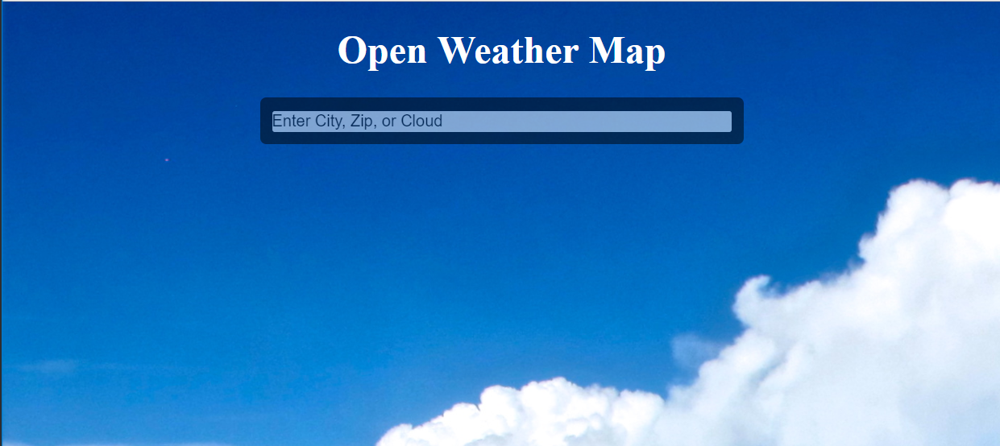
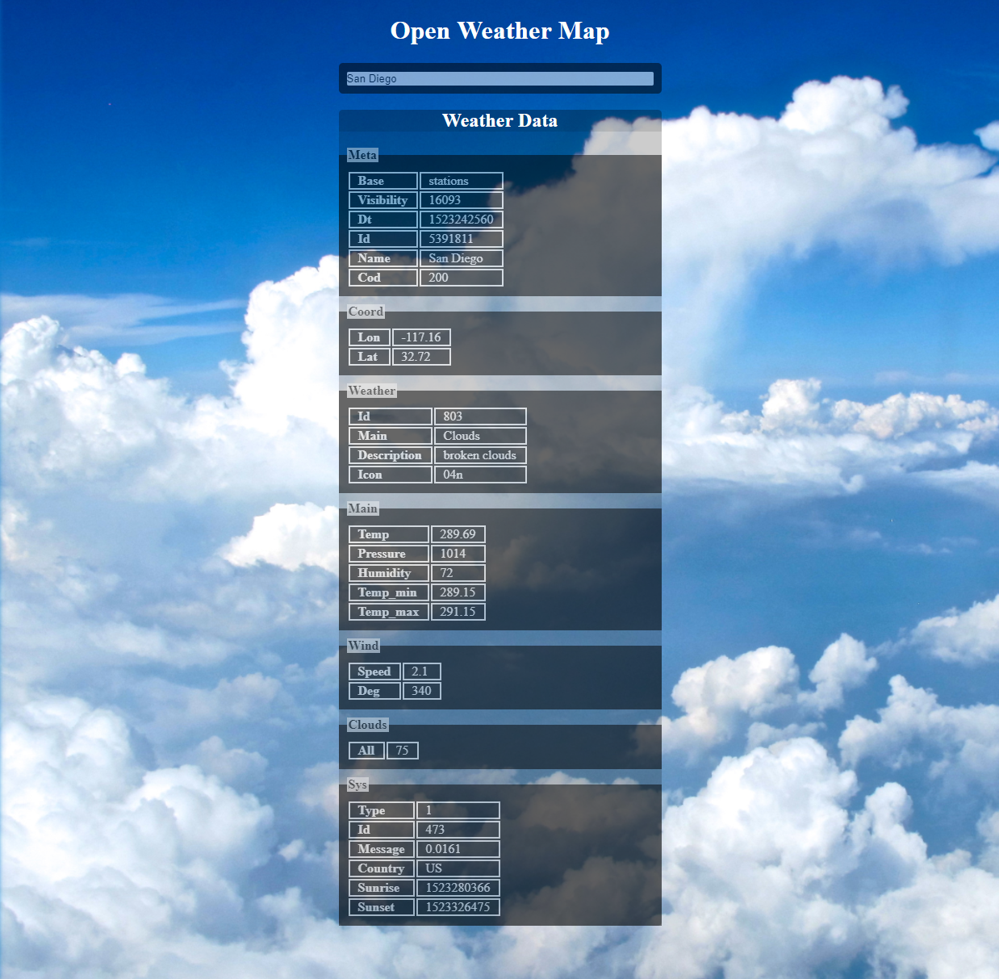

# Open Weather Map

## Overview

A simple Web Development assignment using the [Open Weather Map API](https://openweathermap.org/api) search engine to provide realtime weather coverage

## Link to Assignment

[Open Weather Map](http://159.89.136.195:8881/)

## Example

## Improvements
- Map esoteric weather information with colloquial names and descriptions
- Feedback for invalid inputs
